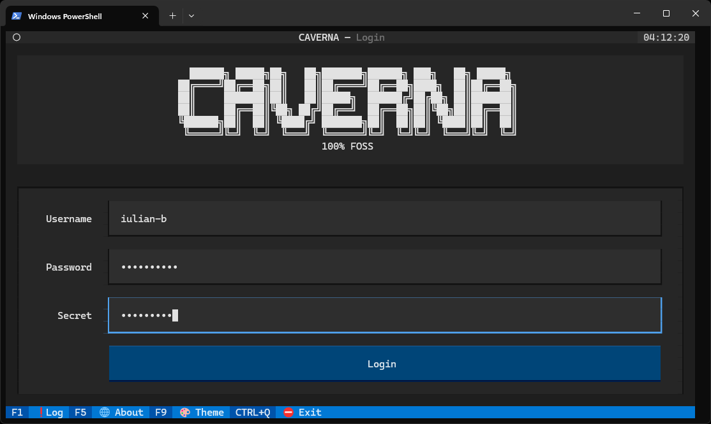
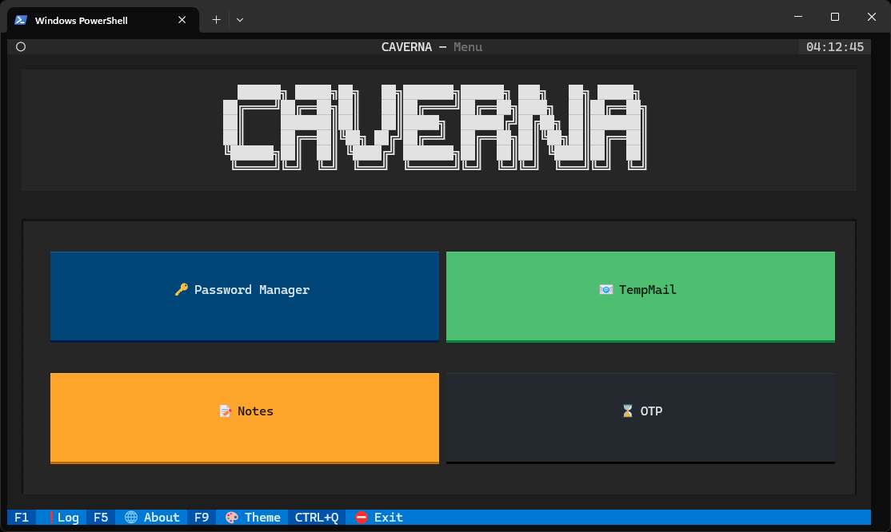
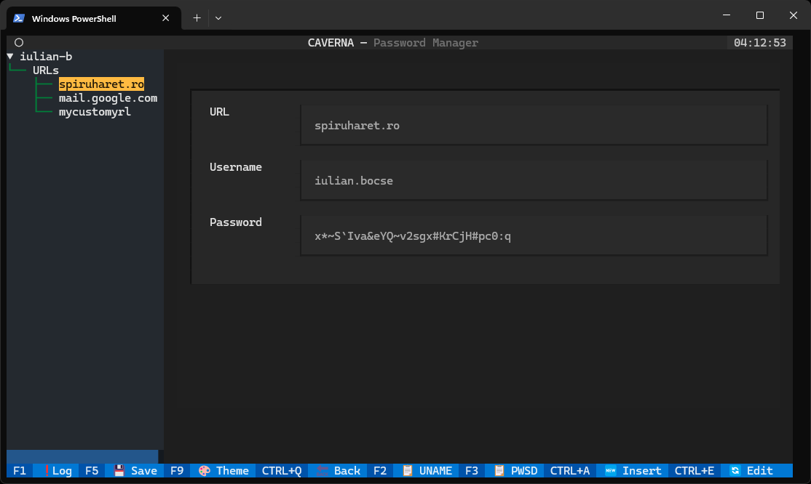
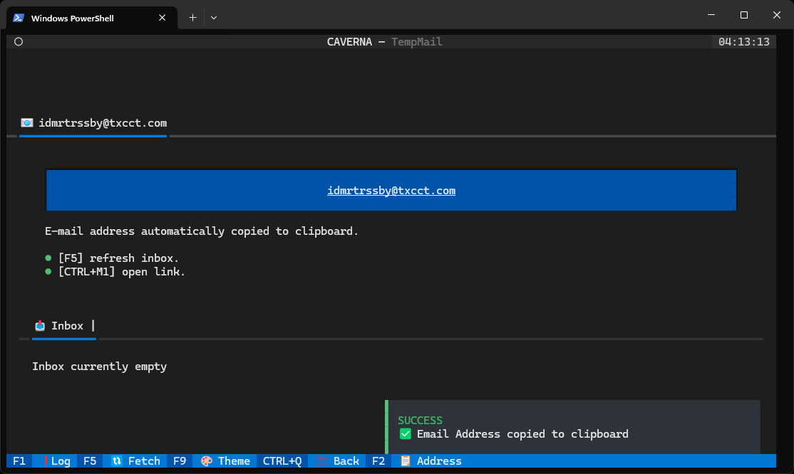
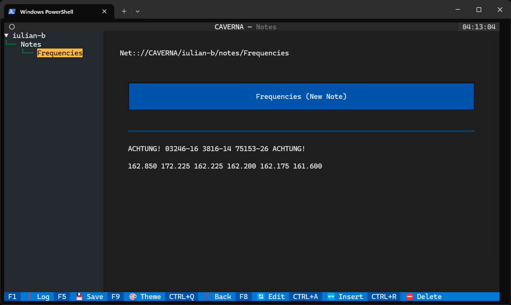
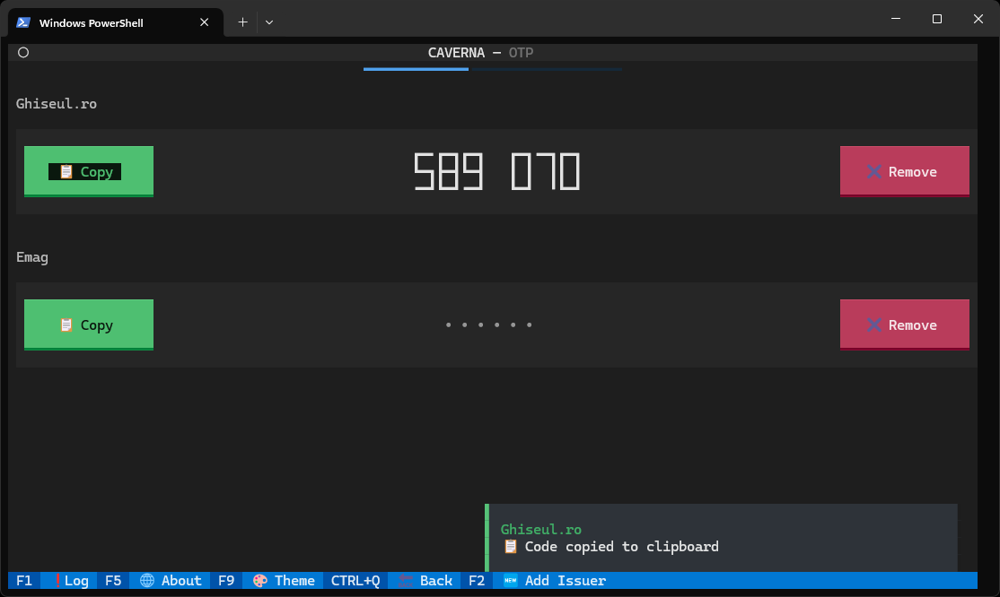
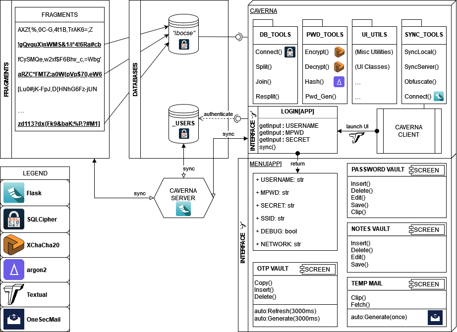

0-Trust, LAN-synched, Secure utility with Password Manger-OTP-TempMail-Notes built in python3 with Textual
___

# Usage
#### Start
    python3 caverna.py

#### Login and Menu

Enter your user credentials: **USERNAME**, **PASSWORD**, **SECRET** 

Change from dark-mode to light-mode anytime by pressing [F9].
Safely exit from the program by pressing [CTRL+Q] from the login or menu page.

#### PasswordManager

Insert, generate, edit and remove credentials sets.
In PasswordManager you can store URLs, Usernames and Passwords.
- [CTRL+A]: Add new entry. A random and secure password will be generated for you, but it can be removed and replaced for a custom one instead.
- [CTRL+E]: Enter/Exit EDIT mode. Press the (SAVE) button in the entry's panel to commit changes or (DELETE) to remove the entry.
- [F5]: Save changes. Any inserts/edits/removals done on the entries will **not** be saved until the save key is pressed.
- [F2]: Copy the currently selected entry's username directly to clipboard.
- [F3]: Copy the currently selected entry's password directly to clipboard.
- [CTRL+Q]: Back to the main menu.

#### TempMail

Once accessed, CAVERNA will generate a random and temporary e-mail address which can **only** recieve mail.
Useful for creating accounts on unsafe or untrusted websites.
To open links from within the recieved mails, use [CTRL+M1].
- [F2]: Copy e-mail address to clipboard. NOTE: The email address will **already** be automatically copied to clipboard once you access TempMail.
- [F5]: Refresh Inbox.
- [CTRL+Q]: Back to the main menu.

#### Notes

Functionally similar to PasswordManager, but for misc textual content, such as personal notes.
Notes support markdown syntax.
- [CTRL+A]: Insert a new blank note.
- [CTRL+R]: Delete selected note.
- [F8]: Enter/Exit to EDIT mode. 
- [F5]: Save changes. Any inserts/edits/removals done on the entries will **not** be saved until the save key is pressed.
- [CTRL+Q]: Back to the main menu.

#### OTP
(Note: Currently only supports TOTP codes)

Store, Add, copy or remove TOTP codes.
Press the (📋COPY) button on any entry to automatically reveal and copy the code to the clipboard.
Press the (✖️REMOVE) button to delete an entry.
- [F2]: Add a new entry, by providing a name (can be anything) and the base64 secret provided by them.
- [CTRL+Q]: Back to the main menu.

#### Other
Print the version:

    python3 caverna.py --version

Print the help screen:
    
    python3 caverna.py --help

---
# Installation
#### (Windows Only) libsqlcipher install
Either follow [this](https://github.com/silverback97/pysqlcipher3-for-windows) or [this](https://stackoverflow.com/questions/55446420/issue-in-installing-pysqlcipher3) guide to install libsqlcipher on windows, or download my build from this [repo](https://github.com/iulian-b/caverna-pysqlcipher)

#### (Linux Only) libsqlcipher install

-  Debian: _sudo apt-get libsqlcipher-dev_
-  Fedora: _sudo dnf install libsqlcipher libsqlcipher-dev_
-  Arch: _sudo pacman -S sqlcipher_
-  Ubuntu: _sudo apt install sqlcipher libsqlcipher-dev_
-  Mint: _sudo apt-get install sqlcipher libsqlcipher-dev_

#### Packages
Install the required packages with:
    
    pip install -r /requirements.txt

#### Server
Copy the contents of _/server_ to yout self-hosted home server. 
To start the server automatically at boot, add the following data to _etc/systemd/system/caverna_server.service_

    [Unit]
    Description=CAVERNA server

    [Service]
    ExecStart=/usr/bin/python3 <PATH/TO/server.py> -t <IP> -p <PORT>

    [Install]
    WantedBy=multi-user.target

(Specify your PATH, host IP and PORT when creating the .service file)

Then execute:
    
    sudo systemctl start caverna_server
    sudo systemctl enable caverna_server   

#### Client
    python3 caverna.py --setup

You will have to provide your home LAN/WLAN SSID, the server's IP and PORT.
Make sure the server is up and running, or the handshake will fail and the setup process will abort.
In case of any changes to the host's address, you can re-run --setup to update the stored settings.

#### Create user
To add new user use:

    python3 caverna.py --new

You will be asked for a USERNAME, MASTER PASSWORD and a SECRET.
For the SECRET, you can use a YubiKey, Nitrokey, Verimark or other alternatives.
Alternatively, you can enter a custom (but secure) key and store it in a DIY solution, such as:

- A rubber ducky 
- A hidden wearable NFC Tag

---
# How it works

#### Fragmentation
User data is stored inside a SQLCipher3 database file (each user gets its own DB), encrypted with his master password + secret.
After a new user is initialized and his DB get created, a function then splits the DB file into N number of "fragments" (determined by the size of the whole DB file), and the "joint/whole" DB file gets deleted.

After a user successfully logs-in, the fragments re-join in the correct order into his encrypted DB file.

#### Obfuscation
All of the fragments inside _/caves_ have their name obfuscated, to prevent unwanted attackers to determine their ownership and order in which they have to be re-assembled.
Their _Creation Time_, _Accesed Time_ and _Modification Time_ also get reset to 01.01.1999 (both on Windows and GNU/Linux) after every user log-off, to prevent attackers from being able to determine which fragments belong to a (albeit unkown) user.

Both of the above obfuscation methods also get executed on the server-side after each upload/download.

#### Encryption and Hashing
All of the data stored in the user's databases are either hashed with [argon2id](https://argon2-cffi.readthedocs.io/en/stable/argon2.html) or encrypted with [XChaCha20](https://pycryptodome.readthedocs.io/en/latest/src/cipher/chacha20.html), depending on the use case.

#### Synchronization
If the user is within network range of the server (a.k.a. connected to the same network), CAVERNA will either determine if the user's data stored on the client is either outdated or newer compared to the data stored on the server: based on this outcome, the client will either _upload()_ or _download()_ the data from/to the server, to maintain user data syncrhonization across CAVERNA clients on multiple different devices. 

Thanks to this, the user can leave the home network at any time, whilst also being able to modify his store data by adding/removing/editing entries in his database.
As long as a user account belongs and gets accesed by **a single individual** person, their data will successfully sync across other devices when they re-join the home network. 

---
### TODO
- hmac for stored settings
- settings menu
- changePWD
- remove user
- switch from flask to BT (if it works)
- rust client (non-POC)
___